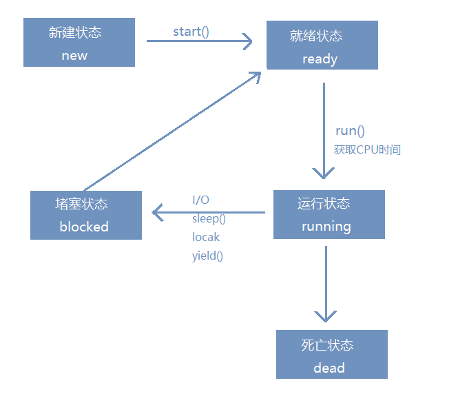

# 必须知道的几个概念

1.进程与线程

进程是资源分配的最小单元，线程是执行(调度)的最小单元；一个进程中必须包含一个或以上的线程

程序是指令的有序集合，其本身没有任何运行的含义，是一个静态的概念，而进程是动态概念是说明程序在系统运行状态中内存的边界

线程是进程中的一个 `基本任务`，每个线程有自己的功能，是CUP分配与调度的基本单位 

2.并发与并行

并行(parallel)：指在同一时刻，有多条指令在多个处理器上同时执行。所以无论从微观还是从宏观来看，二者都是一起执行的。

并发(concurrency)：指在同一时刻只能有一条指令执行，但多个进程指令被快速的轮换执行，使得在宏观上具有多个进程同时执行的效果，
但在微观上并不是同时执行的，只是把时间分成若干段，使多个进程快速交替的执行。

3.同步异步

同步：程序从上至下依次执行，并等待返回结果

异步：程序从上至下依次执行，不并等待返回结果通过回调或者事件去处理；常见的就是ajax请求

4.临界区

临界区指的是一个访问共用资源（例如：共用设备或是共用存储器）的程序片段，而这些共用资源又无法同时被多个线程访问的特性。
当有线程进入临界区段时，其他线程或是进程必须等待（例如：bounded waiting 等待法），有一些同步的机制必须在临界区段的进入
点与离开点实现，以确保这些共用资源是被互斥获得使用，例如：semaphore。只能被单一线程访问的设备，例如：打印机。

5.死锁、活锁、饥饿

死锁：是指两个或两个以上的进程（或线程）在执行过程中，因争夺资源而造成的一种互相等待的现象，若无外力作用，
它们都将无法推进下去。此时称系统处于死锁状态或系统产生了死锁，这些永远在互相等待的进程称为死锁进程。

活锁：是指线程1可以使用资源，但它很礼貌，让其他线程先使用资源，线程2也可以使用资源，但它很绅士，也让其他线程先使用资源。
这样你让我，我让你，最后两个线程都无法使用资源。
 
饥饿：一个或者多个线程因为种种原因无法获得所需要的资源，导致一直无法执行的状态。多线程中优先级高的会优先执行，并且抢占优
先级低的资源，导致优先级低的线程无法得到执行。

6.线程安全

在多线程环境下，同时抢占一个资源 通过同步机制保证各个线程都可以正确执行，不会出现数据污染情况

7.线程安全三大特性（原子性、可见性、有序性）

原子性：指一个操作或者多个操作要么全部执行并且执行的过程不会被任何因素打断，要么就都不执行

可见性：多个线程同时修改一个资源，一个线程修改了对其他线程立马可见

有序性：有序性是指程序在执行的时候，程序的代码执行顺序和语句的顺序是一致的。产生这样问题的原因是由于重排序的缘故。
在Java内存模型中，为了加快程序的运行速度允许编译器和处理器对指令进行重排序，但是重排序过程不会影响到单线程程序的执行，
却会影响到多线程并发执行的正确性。

# Synchronized
Synchronized能够实现原子性和可见性；在Java内存模型中，synchronized规定，线程在互斥代码时，先获得互斥锁→清空工作内存→
在主内存中拷贝最新变量的副本到工作内存→执行完代码→将更改后的共享变量的值刷新到主内存中→释放互斥锁。

# Volatile
Volatile能够实现可见性和有序性；Volatile实现内存可见性是通过store和load指令完成的；也就是对volatile变量执行写操作时，
会在写操作后加入一条store指令，即强迫线程将最新的值刷新到主内存中；而在读操作时，会加入一条load指令，即强迫从主内存中读入变量的值。但volatile不保证volatile变量的原子性

# 线程五种状态

* 新建(new)
* 就绪(ready)
* 运行(running)
* 堵塞(blocked)
* 死亡(dead)
